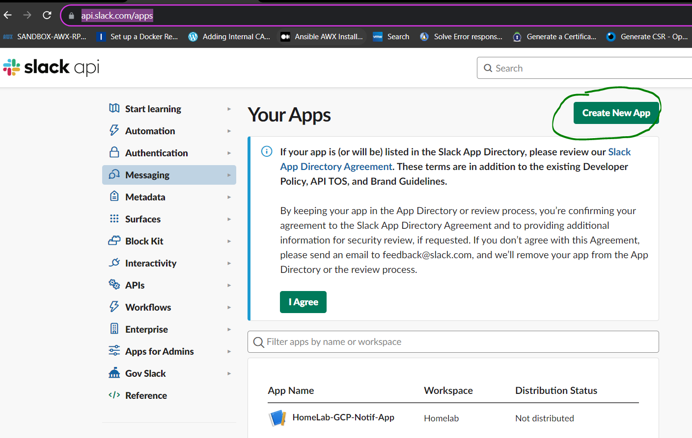
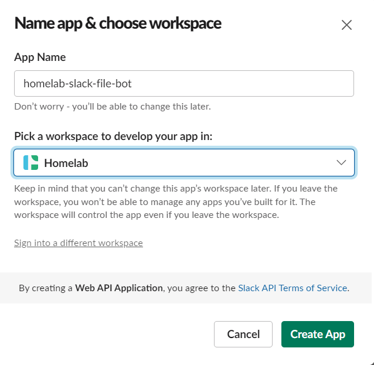

### Creating a Slack App 

1. go to https://api.slack.com/apps and Create a new slack App from scratch as shown below : 

2. Provide the name of App and the workspace it needs to be created in as shown below : 

