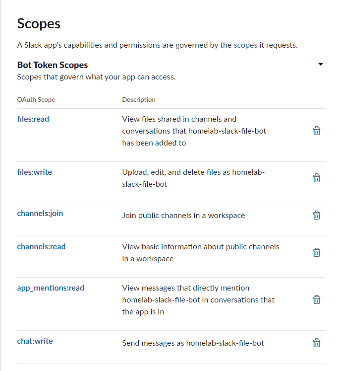

### Creating a Slack App 

1. go to https://api.slack.com/apps and Create a new slack App from scratch as shown below : 

2. Provide the name of App and the workspace it needs to be created in as shown below : 

3. Create Bot token and add below scopes as shown : 

4. Install the App on the workspace : 

5. Add the App on the desired slack channel : 

